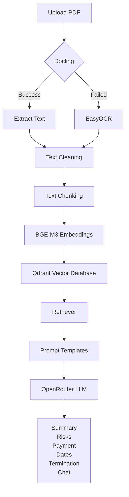
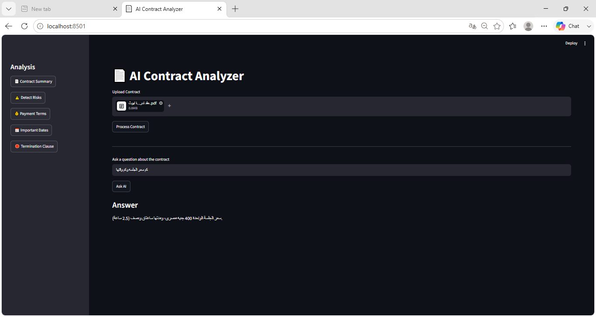

## 📑 Table of Contents

- [Participant](#-participant)
- [Project Overview](#-project-overview)
- [Features](#-features)
- [System Architecture](#-system-architecture)
- [Project Structure](#-project-structure)
- [Technologies Used](#-technologies-used)
- [Installation](#-installation)
- [Usage](#-usage)
- [Demo](#-demo)
- [Results](#-results)
- [Future Improvements](#-future-improvements)
- [About the Challenge](#-about-the-challenge)
- [License](#-license)
# 📄 ContractLensAI

<p align="center">
  
</p>

<h3 align="center">
AI-Powered Legal Contract Analysis using Retrieval-Augmented Generation (RAG)
</h3>

<p align="center">


</p>

---

> 🏆 This repository is my official submission for the **Tips Hindawi Challenge (June–July 2026)**.
## 👤 Participant

| Field | Value |
|--------|-------|
| Full Name | Maha Elbadr Khalifs |
| Project Name | ContractLensAI |
| GitHub Username | YOUR_GITHUB_USERNAME |
| Challenge Batch | June–July 2026 |
| Training Program | Large Language Models (LLMs) Program |
| Organization | Edrak for Ai |

## 📖 Project Overview

ContractLensAI is an AI-powered legal contract analysis system that leverages **Retrieval-Augmented Generation (RAG)** to provide accurate, context-aware insights from legal documents.

The application automatically extracts text from PDF contracts using **Docling**, while **EasyOCR** is used as a fallback for scanned documents. After extraction, the text is cleaned, split into semantic chunks, embedded using the **BAAI BGE-M3** embedding model, and stored in a **Qdrant** vector database for efficient semantic retrieval.

Using **LangChain** and an **OpenRouter-hosted Large Language Model**, the system retrieves the most relevant contract sections and generates reliable responses based solely on the uploaded document.

ContractLensAI enables users to summarize contracts, detect legal risks, extract payment terms, identify important dates, analyze termination clauses, and ask natural language questions through an interactive web interface.

## ✨ Features

- 📄 Extract text from PDF contracts using **Docling**.
- 🔄 Automatically switch to **EasyOCR** for scanned or image-based contracts.
- 🧹 Clean and preprocess extracted text for better AI performance.
- ✂️ Split contracts into semantic chunks using LangChain.
- 🧠 Generate semantic embeddings with **BAAI BGE-M3**.
- 🗄️ Store document embeddings in a **Qdrant** vector database.
- 🔍 Retrieve the most relevant contract sections using semantic search.
- 🤖 Generate AI-powered legal analysis with an OpenRouter-hosted LLM.
- 📑 Generate concise contract summaries.
- ⚠️ Detect potential legal risks and missing clauses.
- 💰 Extract payment terms and financial obligations.
- 📅 Identify important dates and deadlines.
- 🛑 Analyze termination clauses.
- 💬 Ask natural language questions about the uploaded contract.

## System Architecture 


## Project Structure

```text
ContractLensAI
│
├── app.py
├── requirements.txt
├── README.md
│
├── modules/
│   ├── analyzer.py
│   ├── chunker.py
│   ├── document_loader.py
│   ├── embedding.py
│   ├── llm.py
│   ├── ocr.py
│   ├── pdf_loader.py
│   ├── pdf_to_image.py
│   ├── prompt_loader.py
│   ├── retriever.py
│   ├── text_cleaner.py
│   └── vector_store.py
│
├── prompts/
│
├── assets/
│
└── qdrant_data/
```
##Technologies Used

| Category | Technology |
|----------|------------|
| Programming Language | Python 3.11 |
| User Interface | Streamlit |
| LLM Framework | LangChain |
| Embedding Model | BAAI BGE-M3 |
| Vector Database | Qdrant |
| Large Language Model | Qwen (via OpenRouter) |
| PDF Parsing | Docling |
| OCR | EasyOCR |
| PDF Processing | PyMuPDF |
| Environment Management | python-dotenv |

## ⚙️ Installation

### 1. Clone the Repository

```bash
git clone https://github.com/YOUR_USERNAME/ContractLensAI.git
cd ContractLensAI
```

### 2. Create a Virtual Environment

```bash
python -m venv .venv
```

Activate the environment:

**Windows**

```bash
.venv\Scripts\activate
```

**Linux / macOS**

```bash
source .venv/bin/activate
```

### 3. Install Dependencies

```bash
pip install -r requirements.txt
```

### 4. Configure Environment Variables

Create a `.env` file in the project root.

```env
OPENROUTER_API_KEY=your_api_key_here
```

### 5. Run the Application

```bash
streamlit run app.py
```
## 🚀 Usage

1. Launch the Streamlit application.
2. Upload a PDF contract.
3. Click **Process Contract**.
4. Wait until the document is processed.
5. Choose one of the available analyses:
   - 📄 Contract Summary
   - ⚠️ Detect Risks
   - 💰 Payment Terms
   - 📅 Important Dates
   - 🛑 Termination Clause
6. Ask custom questions about the uploaded contract using the AI assistant.

## 📸 Demo

### Home Page

> Add a screenshot of the application's home page.


---

### Contract Analysis

> Add a screenshot showing one of the analysis results.


---

### AI Assistant

> Add a screenshot of the question-answer interface.



## 📈 Results

The system successfully demonstrates how Retrieval-Augmented Generation (RAG) can improve legal document analysis by grounding responses in the uploaded contract.

### Current Capabilities

- Generate concise contract summaries.
- Detect potential legal risks.
- Extract payment terms.
- Identify important contract dates.
- Analyze termination clauses.
- Answer contract-specific questions using semantic retrieval.
- Reduce hallucinations by limiting responses to the retrieved contract context.

## 🔮 Future Improvements

The following enhancements are planned for future versions of **ContractLensAI**.

### 🏗️ Backend Improvements
- 🚀 Build a RESTful API using **FastAPI** to expose the contract analysis services.
- 🔎 Implement Hybrid Search (Dense + Sparse Retrieval).
- 🗂️ Support metadata-based filtering.
- 📚 Enable multi-document analysis.

### 🎨 Frontend Improvements
- 💻 Develop a dedicated frontend using **React.js** or **Next.js**.
- 📱 Improve the user interface with a modern and responsive design.
- 💬 Add chat history and conversation management.

### 🤖 AI Enhancements
- 🧠 Integrate **Self-RAG** to improve retrieval quality and reduce hallucinations.
- 📝 Display source citations for every generated answer.
- ⚡ Support configurable LLM providers and embedding models.

### 📄 Features
- 📑 Export analysis reports as PDF.
- 📊 Visualize contract statistics and risk distribution.
- 🌍 Support multilingual contract analysis.
- 📂 Support additional document formats such as DOCX.

### ☁️ Deployment & Security
- 🐳 Containerize the application using Docker.
- ☁️ Deploy on cloud platforms such as Azure, AWS, or Render.
- 🔐 Add user authentication and secure document management.

## 📚 About the Challenge

This project was developed as part of the **Tips Hindawi Challenge (June–July 2026)** under the **Large Language Models (LLMs) Program** organized by **Edrak for Ai**.

The objective of this project is to demonstrate the practical application of Retrieval-Augmented Generation (RAG), vector databases, and Large Language Models in solving real-world legal document analysis tasks.

## 📄 License

This project was developed for educational purposes as part of the **Tips Hindawi Challenge**.

Feel free to explore and learn from the code.

## 🙏 Acknowledgements

Special thanks to **Edrak for Ai** and the **Tips Hindawi Challenge** for providing the opportunity to build practical applications using Large Language Models and Retrieval-Augmented Generation.
